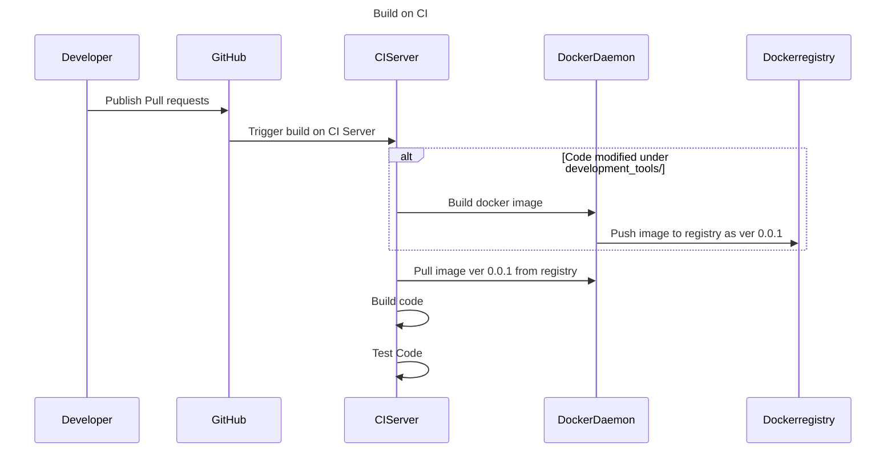
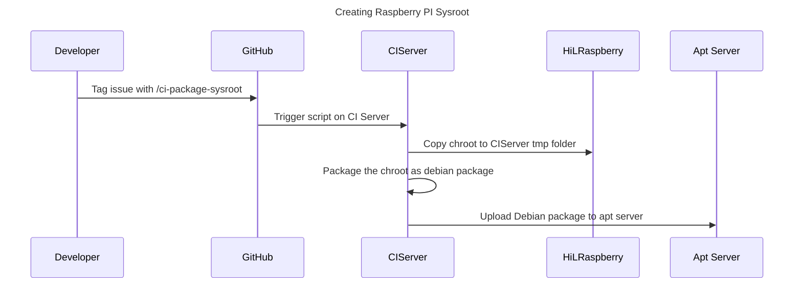

# Development

## Environments 

```mermaid
sequenceDiagram
    title Build on CI
    participant Developer
    participant GitHub
    participant CIServer
    participant DockerDaemon
    participant Dockerregistry

    Developer->>GitHub: Publish Pull requests
    GitHub ->> CIServer: Trigger build on CI Server
    alt Code modified under development_tools/
        CIServer ->> DockerDaemon: Build docker image
        DockerDaemon ->> Dockerregistry: Push image to registry as ver 0.0.1
    end
    CIServer ->> DockerDaemon: Pull image ver 0.0.1 from registry 
    CIServer ->> CIServer: Build code
    CIServer ->> CIServer: Test Code 

```

```mermaid 
sequenceDiagram 
title Creating Raspberry PI Sysroot 
participant Developer 
participant GitHub
participant CIServer
participant HiLRaspberry 
participant Apt Server

Developer ->> GitHub: Tag issue with /ci-package-sysroot 
GitHub ->> CIServer: Trigger script on CI Server 
CIServer ->> HiLRaspberry: Copy chroot to CIServer tmp folder 
CIServer ->> CIServer: Package the chroot as debian package
CIServer ->> Apt Server: Upload Debian package to apt server

```
