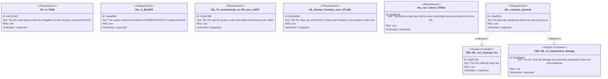

# Hardware in the loop Requirements

```mermaid
requirementDiagram

requirement HIL_is_Pi4B {
    id: 4d1512a0
    text: The HIL itself shall consist of a Raspberry Pi 4B running a raspion 64 bit OS.
    risk: low
    verifymethod: Inspection
}

requirement HIL_is_BluePill {
    id: 0aafe994
    text: The system under test shall be a STM32F103C8T6 on a blue pill board.
    risk: low
    verifymethod: Inspection
}

requirement HIL_Pi_communicate_to_Pill_over_UART {
    id: 01d62788
    text: The HIL and the system under test shall communicate over UART.
    risk: low
    verifymethod: Inspection
}

requirement HIL_flashes_firmware_over_STLINK {
    id: b5105c86
    text: The HIL shall use a STLinkV2 to flash new firmware on the system under test.
    risk: low
    verifymethod: Inspection
}

requirement HIL_can_reboot_STM32 {
    id: b5105c86
    text: The system under test shall be reset (rebooted) via a command line on the HIL.
    risk: low
    verifymethod: Inspection
}

designConstraint TSR_HIL_not_catching_fire {
    id: 2de47c93
    text: The HIL shall not catch fire
    risk: low
    verifymethod: Inspection
}

designConstraint TSR_HIL_no_equipement_damage {
    id: 3edd0a63
    text: The HIL shall not damage any electronic equipment under any circumstances
    risk: low
    verifymethod: Inspection
}

requirement HIL_common_grounds {
    id: cdcef65d
    text: All electronic equipment shall use common ground.
    risk: low
    verifymethod: Inspection
}

HIL_common_grounds - derives -> TSR_HIL_not_catching_fire
HIL_common_grounds - derives -> TSR_HIL_no_equipement_damage

```
