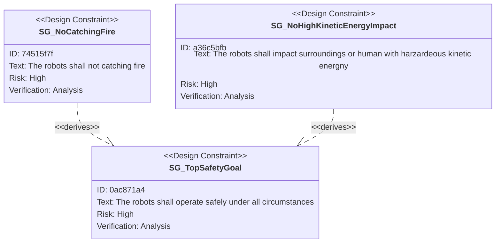
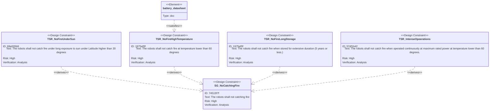

# Safety Goals and Technical Safety Requirements

## Safety Goals

```mermaid 
requirementDiagram

designConstraint SG_TopSafetyGoal {
    id: 0ac871a4
    text: The robots shall operate safely under all circumstances
    risk: high
    verifymethod: analysis
}

designConstraint SG_NoCatchingFire {
    id: 74515f7f
    text: The robots shall not catching fire
    risk: high
    verifymethod: analysis
}

designConstraint SG_NoHighKineticEnergyImpact {
    id: a36c5bfb
    text: The robots shall impact surroundings or human with harzardeous kinetic energny
    risk: high
    verifymethod: analysis
}

SG_NoCatchingFire - derives -> SG_TopSafetyGoal
SG_NoHighKineticEnergyImpact - derives -> SG_TopSafetyGoal
```

## Safety goal decomposition: Fire Hazard

```mermaid
requirementDiagram

designConstraint TSR_NoFireUnderSun {
    id: 69e005b9
    text: The robots shall not catch fire under long exposure to sun under Latitude higher than 30 degrees
    risk: high
    verifymethod: analysis
}

designConstraint TSR_NoFireHighTemperature {
    id: 1975ef0f
    text: The robots shall not catch fire at temperature lower than 60 degrees
    risk: high
    verifymethod: analysis
}

designConstraint TSR_NoFireLongStorage {
    id: 1975ef0f
    text: The robots shall not catch fire when stored for extensive duration (5 years or less.)
    risk: high
    verifymethod: analysis
}

designConstraint TSR_IntenseOpeerations {
    id: 57df1b42
    text: The robots shall not catch fire when operated continuously at maximum rated power at temperature lower than 60 degrees.
    risk: high
    verifymethod: analysis
}

designConstraint SG_NoCatchingFire {
    id: 74515f7f
    text: The robots shall not catching fire
    risk: high
    verifymethod: analysis
}

element battery_datasheet {
    type: doc
}

battery_datasheet - satisfies -> TSR_NoFireHighTemperature
TSR_NoFireUnderSun - derives -> SG_NoCatchingFire
TSR_NoFireHighTemperature - derives -> SG_NoCatchingFire
TSR_NoFireLongStorage - derives -> SG_NoCatchingFire
TSR_IntenseOpeerations - derives -> SG_NoCatchingFire
```
