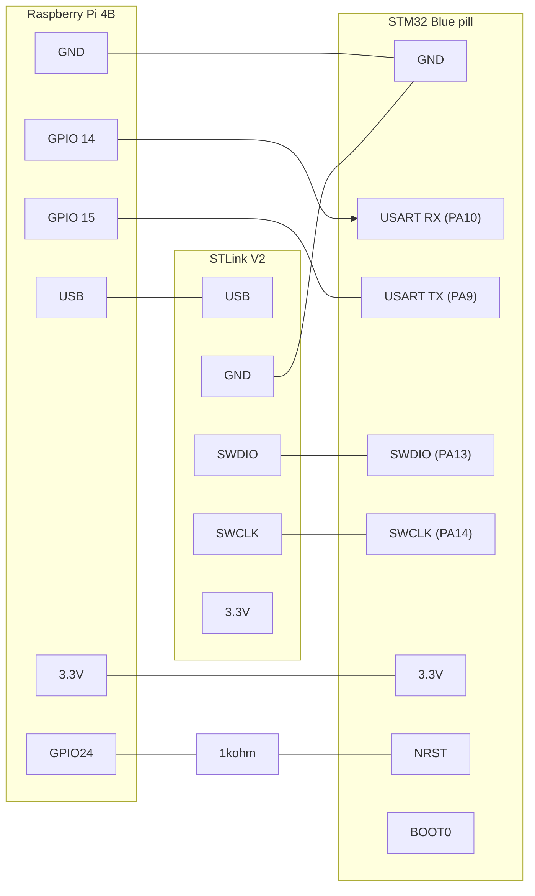

# Hardware in the loop 

# Hardware in the loop for raspberry Pi controller 

## Wiring
The setup uses STLinkV2 connector, connected over USB. 
There is a UART communication between the Raspberry Pi4B and the STM32.

**STM32 bluepill pining**  


**Raspberry Pi4B pining**  
See this page for the [Rasperry Pi pining](https://www.raspberrypi.com/documentation/computers/raspberry-pi.html).
Look especially at this [diagram](https://www.raspberrypi.com/documentation/computers/images/GPIO-Pinout-Diagram-2.png?hash=df7d7847c57a1ca6d5b2617695de6d46)


## Workflow 

The firmware is flashed from the raspberry pi to the STM32 with 
```
st-flash write firmware.bin 0x08000000
``` 

The chip is then reset like this 
```
st-flash reset
```

During exection whe can also Pull the NRST directly from RPI GPIO to stop execution.
