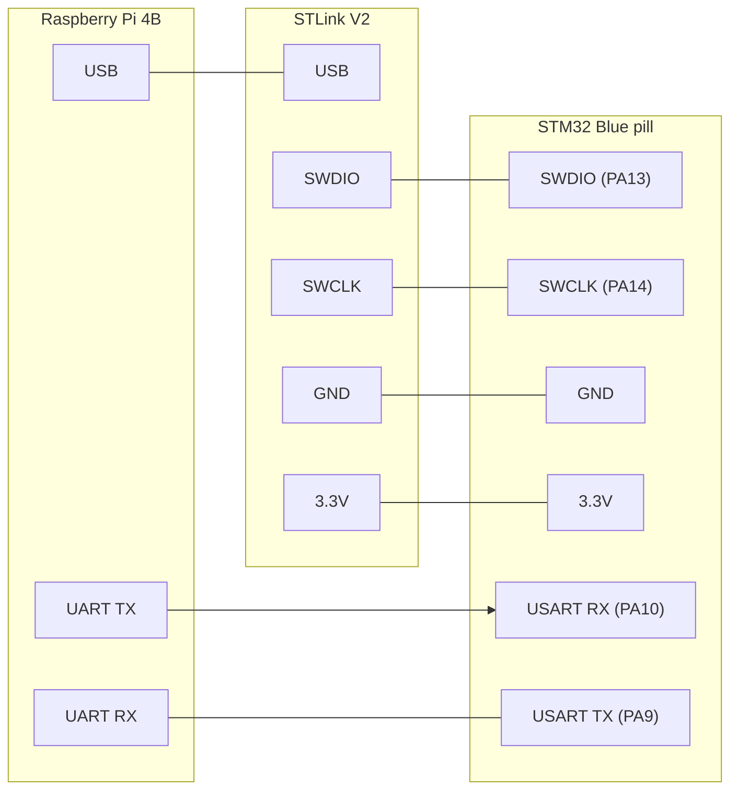

# Hardware in the loop 

# Hardware in the loop for raspberry Pi controller 

The setup uses STLinkV2 connector, connected over USB. 
There is a UART communication between the Raspberry Pi4B and the STM32.

