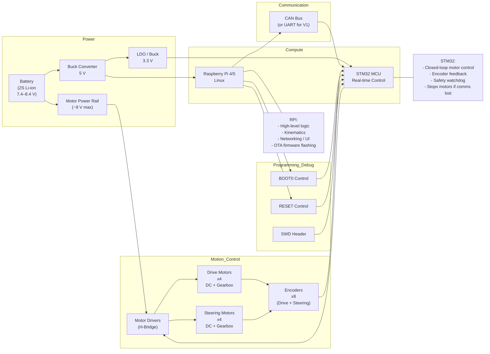

# Robot system design

Overall system design

```mermaid
flowchart LR
    %% =======================
    %% Power
    %% =======================
    subgraph Power
        Battery["Battery<br/>(2S Li-ion<br/>7.4–8.4 V)"]
        MotorRail["Motor Power Rail<br/>(~9 V max)"]
        Buck5V["Buck Converter<br/>5 V"]
        Reg33["LDO / Buck<br/>3.3 V"]
    end

    %% =======================
    %% Compute
    %% =======================
    subgraph Compute
        RPi["Raspberry Pi 4/5<br/>Linux"]
        STM32["STM32 MCU<br/>Real-time Control"]
    end

    %% =======================
    %% Communication
    %% =======================
    subgraph Communication
        CAN["CAN Bus<br/>(or UART for V1)"]
    end

    %% =======================
    %% Motion Control
    %% =======================
    subgraph Motion_Control
        Drivers["Motor Drivers<br/>(H-Bridge)"]
        DriveMotors["Drive Motors<br/>x4<br/>DC + Gearbox"]
        SteeringMotors["Steering Motors<br/>x4<br/>DC + Gearbox"]
        Encoders["Encoders<br/>x8<br/>(Drive + Steering)"]
    end

    %% =======================
    %% Programming & Debug
    %% =======================
    subgraph Programming_Debug
        SWD["SWD Header"]
        BOOT0["BOOT0 Control"]
        RESET["RESET Control"]
    end

    %% Power connections
    Battery --> MotorRail
    Battery --> Buck5V
    Buck5V --> RPi
    Buck5V --> Reg33
    Reg33 --> STM32

    %% Communication
    RPi --> CAN
    CAN --> STM32

    %% Motion control
    STM32 --> Drivers
    MotorRail --> Drivers

    Drivers --> DriveMotors
    Drivers --> SteeringMotors

    DriveMotors --> Encoders
    SteeringMotors --> Encoders
    Encoders --> STM32

    %% Programming / OTA
    RPi --> BOOT0
    RPi --> RESET
    BOOT0 --> STM32
    RESET --> STM32
    SWD --> STM32

    %% Notes (as info nodes)
    STM32_note["STM32:<br/>- Closed-loop motor control<br/>- Encoder feedback<br/>- Safety watchdog<br/>- Stops motors if comms lost"]
    RPi_note["RPi:<br/>- High-level logic<br/>- Kinematics<br/>- Networking / UI<br/>- OTA firmware flashing"]

    STM32 --- STM32_note
    RPi --- RPi_note

```
